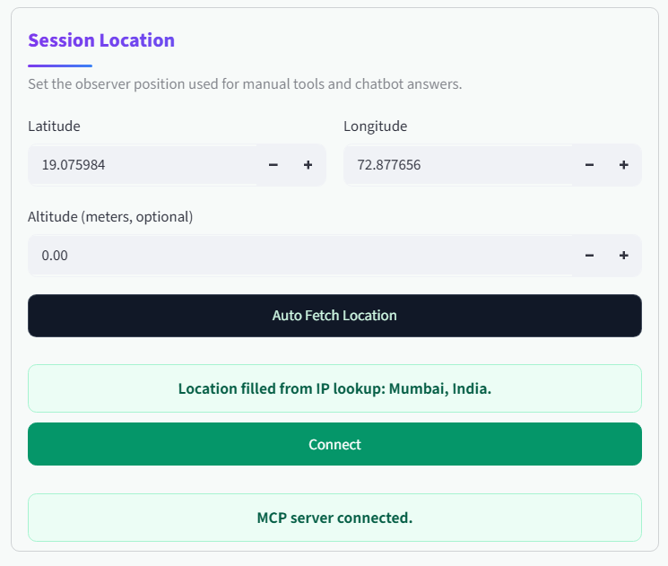
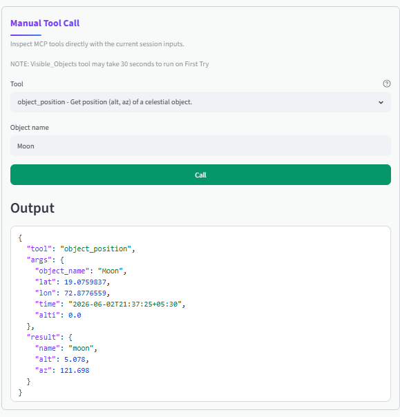
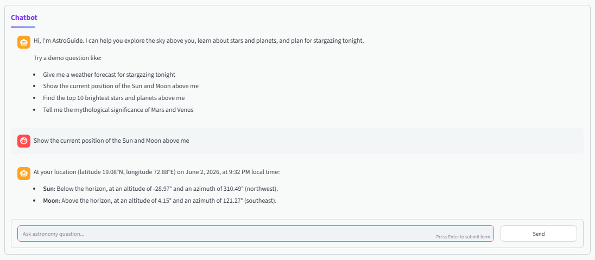
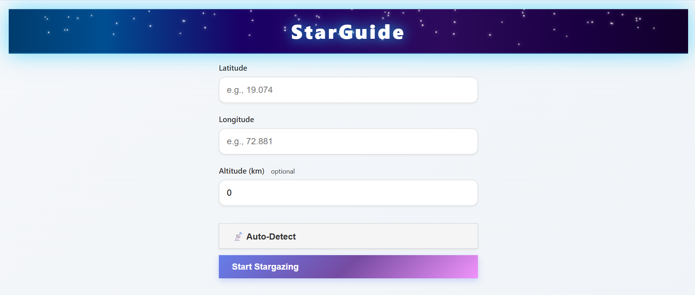
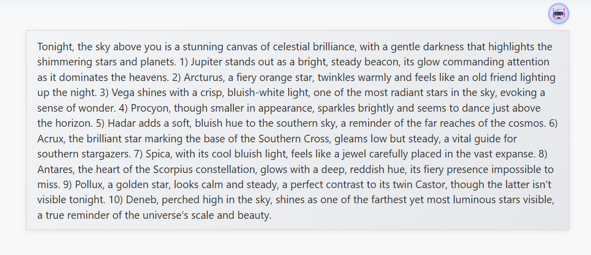
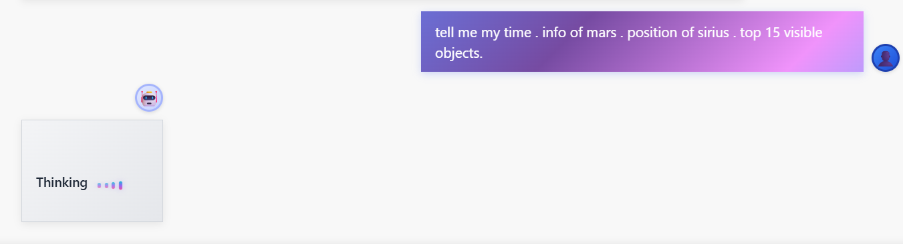
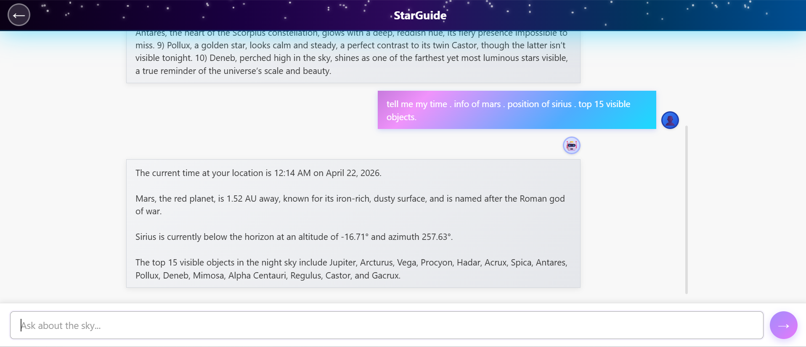

# StarGuide MCP AI Tool


<a href = "https://star-guide-mcp.streamlit.app/" > APP1 </a>


<a href = "https://ujwalsahu123.github.io/MCP--Project_Stargazing_AI_Guide/" > APP2 </a>

Note -> It takes a few Minutes to Run at the First Start (due to starting the Backend, MCP server)











StarGuide is a browser-based stargazing assistant built as a complete MCP-powered application:

1. A static frontend collects the user's location and questions.
2. A FastAPI backend turns those inputs into LLM requests and MCP tool calls.
3. An MCP server performs the actual astronomy work such as visibility checks and sky positions.

The result is a guided "what can I see tonight?" experience where the interface feels conversational, but the answers can still use live sky data for the user's current place and time.

This README is intentionally detailed. It explains not only how to run the project, but also how the requests move through the frontend, backend, and MCP server, what each file is responsible for, and a few implementation details that matter when you maintain or extend the project.

## What This Project Does

At a high level, the app works like this:

1. The user opens the frontend and either types latitude/longitude manually or uses browser geolocation.
2. The frontend creates a current ISO-8601 timestamp in the browser, including the browser's timezone offset.
3. The frontend sends location + time to the backend's `/initial` endpoint.
4. The backend asks the MCP server which celestial objects are visible from that location and time.
5. The backend then asks Azure OpenAI to turn that result into a friendly, streamed introduction.
6. The user asks follow-up questions like "Where is Mars right now?" or "Tell me about Sirius."
7. The backend decides whether the question needs live tools or just general astronomy knowledge.
8. If tools are needed, the backend calls the MCP server, collects the live data, and streams the final answer back to the frontend.

So the frontend is the user experience layer, the backend is the orchestration layer, and the MCP server is the astronomy data/calculation layer.

## Project Structure

Actual current structure:

```text
4_Project_StarGuide_MCP_AI_tool/
|-- index.html
|-- script.js
|-- style.css
|-- README.md
|-- Backend/
|   |-- main.py
|   |-- mcp_client.py
|   |-- object_names.json
|   |-- pyproject.toml
|   |-- requirements.txt
|   |-- test1.py
|   |-- test2.py
|   |-- test3.py
|   `-- uv.lock
`-- MCP_Server/
    |-- main.py
    |-- tools.py
    |-- star_info.json
    |-- test.py
    |-- pyproject.toml
    |-- requirements.txt
    |-- skyfield-data/
    |   `-- de440s.bsp
    `-- uv.lock
```

Important note: the frontend is not inside a `Frontend/` folder. The frontend files live directly at the project root:

- `index.html`
- `script.js`
- `style.css`

## Architecture Overview

```text
Browser frontend
  |
  |  POST /initial, POST /chat
  v
FastAPI backend
  |
  |  Azure OpenAI calls
  |  MCP JSON-RPC over HTTP + SSE parsing
  v
Remote or local MCP server
  |
  |  Skyfield + Astropy + Astroquery + local JSON metadata
  v
Astronomical calculations and object details
```

### Current deployed services used by the code

- Frontend API target in `script.js`:
  `https://mcp-project-stargazing-ai-guide.onrender.com`
- Backend MCP target in `Backend/mcp_client.py`:
  `https://MCP-Project-Stargazing.fastmcp.app/mcp`

That means the checked-in frontend currently talks to the deployed backend, and the checked-in backend currently talks to the deployed MCP server.

## Quick Start

There are three practical ways to use this repository.

### Option 1: Fastest demo using the deployed backend

This is the easiest path because the frontend already points to the live backend URL in `script.js`.

1. Start a simple static file server from the project root:

```bash
cd 4_Project_StarGuide_MCP_AI_tool
python -m http.server 5500
```

2. Open:

```text
http://localhost:5500
```

3. Enter latitude and longitude manually, or click `Auto-Detect`.

4. Click `Start Stargazing`.

No backend environment setup is required for this mode because the frontend uses the deployed backend.

### Option 2: Run the frontend locally and the backend locally

Use this mode if you want to develop or debug the backend while still using the same frontend.

#### Step 1: Configure the backend environment

Create `Backend/.env` with:

```env
AZURE_OPENAI_ENDPOINT=https://your-resource-name.openai.azure.com
AZURE_OPENAI_API_KEY=your_azure_openai_api_key
AZURE_OPENAI_DEPLOYMENT_NAME=your_deployment_name
STARGUIDE_API_KEY=your_mcp_server_api_key
```

`STARGUIDE_API_KEY` is required in this setup because the current backend code points to the deployed MCP server and sends a bearer token in the `Authorization` header.

#### Step 2: Install backend dependencies

```bash
cd Backend
uv sync
```

#### Step 3: Start the backend

```bash
uv run python main.py
```

The backend runs on:

```text
http://localhost:8000
```

Docs are available at:

```text
http://localhost:8000/docs
```

#### Step 4: Point the frontend to the local backend

Edit the first line of `script.js`:

```js
const CONFIG = { API_ENDPOINT: 'http://localhost:8000' };
```

#### Step 5: Serve the frontend from the project root

```bash
cd ..
python -m http.server 5500
```

Open:

```text
http://localhost:5500
```

### Option 3: Run the frontend, backend, and MCP server locally

Use this mode if you want the whole stack under your control.

Important before you start:

- the backend is configured for port `8000`;
- the MCP server is also configured for port `8000`.

So you cannot run both locally at the same time without changing one of the ports.

#### Step 1: Start the MCP server

The simplest approach is to change the MCP server port first.

In `MCP_Server/main.py`, change:

```python
mcp.run(transport="http", host="0.0.0.0", port=8000)
```

to something like:

```python
mcp.run(transport="http", host="0.0.0.0", port=8001)
```

Then start it:

```bash
cd MCP_Server
uv sync
uv run python main.py
```

#### Step 2: Update the backend MCP URL

The backend currently hardcodes:

```python
MCP_SERVER_URL = "https://MCP-Project-Stargazing.fastmcp.app/mcp"
```

Change that in `Backend/mcp_client.py` to the HTTP endpoint exposed by your local FastMCP server.

For most local FastMCP HTTP setups this will mirror the deployed route shape and look like:

```text
http://localhost:8001/mcp
```

If your local FastMCP process exposes a different URL, use that exact URL instead.

#### Step 3: Start the backend

```bash
cd ../Backend
uv sync
uv run python main.py
```

#### Step 4: Point the frontend to the local backend

In `script.js`:

```js
const CONFIG = { API_ENDPOINT: 'http://localhost:8000' };
```

#### Step 5: Serve the frontend

```bash
cd ..
python -m http.server 5500
```

## Frontend

The frontend is a dependency-free static UI written in plain HTML, CSS, and JavaScript.

### Frontend files

- `index.html`: page structure for the location screen and chat screen.
- `script.js`: all UI logic, request handling, NDJSON stream parsing, and chat state.
- `style.css`: galaxy-themed styling, loading states, responsive layout, and chat visuals.

### Frontend behavior

The frontend has two screens inside one HTML page:

1. A location setup screen.
2. A chat screen.

It toggles between them by adding and removing the `hidden` class.

### Location setup flow

When the user opens the app:

1. They can type latitude manually.
2. They can type longitude manually.
3. They can optionally provide altitude.
4. They can click `Auto-Detect`, which uses `navigator.geolocation`.
5. They click `Start Stargazing`.

Validation rules in the browser:

- Latitude must be between `-90` and `90`.
- Longitude must be between `-180` and `180`.
- Altitude must be `>= 0`.

### What the frontend sends on the first request

When `startStargazing()` runs, the frontend generates the time in the browser using `getISOTime()`.

That means the timestamp is not guessed by the backend. It is explicitly sent by the client on every request.

Example shape:

```json
{
  "latitude": 19.074,
  "longitude": 72.881,
  "altitude": 0,
  "time": "2026-04-21T22:13:05+05:30"
}
```

This detail matters because it means:

- every `/initial` request contains the user's current time;
- every `/chat` request also contains a fresh current time;
- the timezone offset is included;
- if the browser clock is wrong, the astronomy answers can also be wrong.

### How the frontend handles streaming

Both the initial session and chat can consume NDJSON streaming responses.

The `streamNdjson()` function:

1. reads the `ReadableStream` from `fetch()`;
2. decodes bytes using `TextDecoder`;
3. accumulates lines until a full JSON line is available;
4. parses each line independently;
5. passes parsed chunks to the relevant UI handler.

### Chat flow in the frontend

When the user asks a question:

1. The query is added to the local chat UI immediately.
2. The frontend generates a new current timestamp again using `getISOTime()`.
3. The frontend sends:
   - `query`
   - `latitude`
   - `longitude`
   - `altitude`
   - `time`
   - `chat_history`

Example payload:

```json
{
  "query": "Where is Jupiter right now?",
  "latitude": 19.074,
  "longitude": 72.881,
  "altitude": 0,
  "time": "2026-04-21T22:15:11+05:30",
  "chat_history": [
    {
      "role": "assistant",
      "content": "Tonight's sky opens above you..."
    },
    {
      "role": "user",
      "content": "Tell me about Sirius"
    },
    {
      "role": "assistant",
      "content": "Sirius is the brightest star..."
    }
  ]
}
```

One important implementation detail: the current message is sent in the `query` field, and `chat_history` is sent as `state.chatHistory.slice(0, -1)`. That means the newest user message is not duplicated inside history because it is already present in `query`.

### Frontend UX details

The current UI includes:

- a galaxy-style header;
- 75 animated decorative stars;
- an auto-detect location button;
- a large loading state for the initial session;
- an inline "Thinking" loader for chat replies;
- chat bubbles for both user and assistant messages;
- responsive layout rules for mobile screens.

There is no React, no bundler, and no framework build step.

## Backend

The backend is a FastAPI app that does two kinds of orchestration:

1. It talks to Azure OpenAI.
2. It talks to the MCP server.

### Backend files

- `Backend/main.py`: FastAPI app, request models, routes, and streaming responses.
- `Backend/mcp_client.py`: actual orchestration logic for prompts, tool planning, MCP calls, and stream generation.
- `Backend/object_names.json`: canonical object names and aliases used to guide tool selection.

### Backend endpoints

#### `GET /health`

Basic health check.

Example response:

```json
{
  "status": "healthy",
  "version": "1.0.0",
  "message": "StarGuide API is running"
}
```

#### `POST /initial`

Starts the user's stargazing session.

Input:

```json
{
  "latitude": 19.074,
  "longitude": 72.881,
  "altitude": 0,
  "time": "2026-04-21T22:13:05+05:30"
}
```

Current behavior:

1. The backend validates the request with Pydantic.
2. The backend calls the MCP tool `visible_objects`.
3. The backend normalizes the result.
4. The backend takes the top 10 visible objects for the opening experience.
5. The backend asks the LLM to generate a warm streamed opening about tonight's sky and those objects.
6. The backend streams the answer back as NDJSON.

Current stream chunk types for `/initial`:

- `intro`
- `complete`
- `error`

Example:

```json
{"type":"intro","content":"Tonight the sky above your horizon feels alive..."}
{"type":"intro","content":"1) Venus stands out first..."}
{"type":"complete","total_objects_available":31,"objects_returned":10}
```

#### `POST /chat`

Answers user questions about the sky.

Input:

```json
{
  "query": "Where is Venus right now?",
  "latitude": 19.074,
  "longitude": 72.881,
  "altitude": 0,
  "time": "2026-04-21T22:15:11+05:30",
  "chat_history": [
    {
      "role": "assistant",
      "content": "Tonight's sky opens above you..."
    }
  ]
}
```

Current stream chunk types for `/chat`:

- `metadata`
- `direct_response`
- `response`
- `complete`
- `error`

Two runtime modes exist:

1. `direct` mode:
   the planner decides no tool is needed, so the first LLM answer is returned directly as `direct_response`.
2. `stream` mode:
   the planner asks for one or more tools, the backend executes them, and the second LLM call streams the final answer through `response` chunks.

### CORS and streaming behavior

The backend currently allows:

- all origins;
- all methods;
- all headers.

Both streaming endpoints return `application/x-ndjson` and set headers aimed at reducing buffering:

- `Cache-Control: no-cache, no-transform`
- `X-Accel-Buffering: no`
- `Connection: keep-alive`

## How the Backend Works Internally

The backend logic lives mostly in `Backend/mcp_client.py`.

### MCP communication strategy

The backend does not use MCP via a browser client. It calls the MCP server directly over HTTP using JSON-RPC style payloads.

Request structure:

```json
{
  "jsonrpc": "2.0",
  "id": 1,
  "method": "tools/call",
  "params": {
    "name": "visible_objects",
    "arguments": {
      "lat": 19.074,
      "lon": 72.881,
      "time": "2026-04-21T22:13:05+05:30",
      "alti": 0
    }
  }
}
```

The backend sends:

- `Content-Type: application/json`
- `Accept: application/json, text/event-stream`
- `Authorization: Bearer <STARGUIDE_API_KEY>`

Then `parse_sse_response()` extracts the JSON payload from the SSE `data:` line.

### LLM strategy for `/initial`

The initial flow is simple:

1. Call `visible_objects`.
2. Keep up to 10 objects for the opening experience.
3. Ask the LLM for a warm introductory sky description.
4. Stream text as it arrives.

The initial prompt is designed to produce:

- a short 2-sentence opening;
- a flowing description of each selected object;
- natural language rather than raw coordinate-heavy output.

### LLM strategy for `/chat`

The chat flow uses two stages.

#### Stage 1: Planner

The first system prompt tells the model:

- focus primarily on the current query;
- treat history as secondary unless the new question clearly depends on it;
- avoid tool calls for greetings and simple unrelated messages;
- use tools only when live location/time data is actually needed;
- use the minimum necessary tool set.

This stage can request:

- `visible_objects`
- `object_position`
- `object_detail`

#### Stage 2: Tool execution

The backend executes only the tools the planner asked for.

Examples:

- "Hi" should need no tools.
- "What is Mars?" should usually need no tools.
- "Where is Mars right now?" should use `object_position`.
- "What is visible tonight?" should use `visible_objects`.
- "Tell me about Sirius and where it is" may use both `object_detail` and `object_position`.

#### Stage 3: Final answer generation

If tools were used:

1. The tool outputs are appended into a final prompt.
2. A second LLM call is made.
3. That second call streams the user-facing answer.

The second system prompt instructs the model to:

- use tool results as the primary source of truth when provided;
- answer directly;
- keep the answer short and focused;
- avoid mentioning tools or internal reasoning.

### Object name assistance

`Backend/object_names.json` contains 51 supported names and aliases.

Examples:

- `Sirius` -> alias `dog star`
- `Venus` -> aliases `morning star`, `evening star`
- `Mars` -> alias `red planet`
- `Polaris` -> alias `north star`

This file is injected into planner context so the model is more likely to choose valid tool inputs.

## MCP Server

The MCP server is the astronomy engine of the project.

### MCP server files

- `MCP_Server/main.py`: FastMCP server and tool registration.
- `MCP_Server/tools.py`: astronomy logic.
- `MCP_Server/star_info.json`: static object detail database.
- `MCP_Server/skyfield-data/de440s.bsp`: ephemeris data used by Skyfield.

### Registered tools

The MCP server exposes three tools:

1. `visible_objects`
2. `object_position`
3. `object_detail`

### `visible_objects`

Purpose:

- find which supported objects are above the horizon at the requested place and time.

Current code path:

1. Resolve observation time.
2. Compute solar-system body positions.
3. Compute star positions.
4. Keep only objects with altitude above `0`.
5. Sort by magnitude, where lower magnitude means brighter.
6. Return up to 50 objects.

Important implementation detail:

- the catalog is intentionally limited, not infinite sky coverage;
- it uses 41 bright stars plus 10 solar-system bodies, for 51 named objects in total;
- because only visible objects are returned and then capped at 50, the response is effectively "the visible subset of the supported catalog, brightness-sorted."

Raw MCP response shape:

```json
[
  {
    "name": "Venus",
    "type": "planet",
    "alt": 45.2,
    "az": 280.5,
    "magnitude": -4.0,
    "brightness": -4.0
  }
]
```

### `object_position`

Purpose:

- return precise sky position for one named object.

Output shape:

```json
{
  "alt": 32.48,
  "az": 214.17
}
```

Important behavior:

- if the object is below the horizon, the altitude can be negative;
- unlike `visible_objects`, this tool is not limited to only positive altitude results.

### `object_detail`

Purpose:

- return descriptive information from `star_info.json`.

Output includes fields such as:

- `display_name`
- `type`
- `distance`
- `constellation`
- `description`
- `mythology`

This tool is static metadata, not a live sky calculation.

## How the Astronomy Layer Works

`MCP_Server/tools.py` combines several astronomy/data libraries:

- `Skyfield` for solar-system positions and ephemeris work.
- `Astropy` for coordinate transformations.
- `Astroquery` with `Vizier` for star coordinates and visual magnitudes.
- `star_info.json` for descriptive metadata.

### Time handling

The helper `_resolve_observation_times()` supports:

- `None`
- ISO string
- `datetime`
- `astropy.time.Time`
- Skyfield time-like objects

That means the server can work with either user-provided time strings or internally generated times.

### Ephemeris loading

On startup the server:

1. looks for `de440s.bsp`;
2. tries configured candidate directories;
3. loads it through Skyfield;
4. performs a small health check by observing Mars from Earth.

This is a nice defensive touch because it helps catch broken or truncated ephemeris files early.

### Brightness logic

There are two brightness paths:

1. Solar-system bodies use approximate hardcoded magnitude values.
2. Stars try to fetch real `Vmag` values from Vizier catalogs and cache them in `_STAR_MAGNITUDE_CACHE`.

### Position logic

- Solar-system positions are calculated topocentrically using the observer's latitude, longitude, altitude, and observation time.
- Star positions are obtained by fetching RA/Dec from Vizier, then transforming those into altitude/azimuth for the observer's location and time.

## End-to-End Request Lifecycle

This section is the "how everything works together" version.

### Initial session lifecycle

1. The browser collects latitude, longitude, altitude, and the current browser time.
2. The browser sends them to `POST /initial`.
3. The backend calls `visible_objects` on the MCP server.
4. The MCP server calculates which supported objects are above the horizon.
5. The backend keeps the top 10 for the opening experience.
6. The backend asks Azure OpenAI to produce the opening narrative.
7. The backend streams NDJSON `intro` chunks back to the browser.
8. The browser appends those chunks into one assistant message bubble.
9. The browser stores the final opening text in `state.chatHistory`.

### Chat lifecycle

1. The browser reads the user's new question.
2. The browser generates a fresh current time again.
3. The browser sends the new `query`, the current location, and the chat history.
4. The backend runs the planner LLM call.
5. If no tool is needed, the planner answer is returned directly.
6. If tools are needed, the backend calls the MCP server.
7. The MCP server returns live visibility, position, or detail data.
8. The backend builds a final prompt from the tool results.
9. The backend streams the final answer back through NDJSON `response` chunks.
10. The browser updates the assistant message live and stores the final answer in history.

## Request and Response Examples

### Example `/initial` request

```bash
curl -X POST http://localhost:8000/initial ^
  -H "Content-Type: application/json" ^
  -d "{\"latitude\":19.074,\"longitude\":72.881,\"altitude\":0,\"time\":\"2026-04-21T22:13:05+05:30\"}"
```

### Example `/chat` request

```bash
curl -X POST http://localhost:8000/chat ^
  -H "Content-Type: application/json" ^
  -d "{\"query\":\"Where is Venus right now?\",\"latitude\":19.074,\"longitude\":72.881,\"altitude\":0,\"time\":\"2026-04-21T22:15:11+05:30\",\"chat_history\":[]}"
```

### Example streamed chat response

```json
{"type":"metadata","query":"Where is Venus right now?","tools_requested":["object_position"],"tools_called":1,"mode":"stream"}
{"type":"response","content":"Venus is currently low in the western sky..."}
{"type":"response","content":"..."}
{"type":"complete","success":true,"mode":"stream"}
```

## Dependencies

### Backend dependencies

From `Backend/pyproject.toml`:

- `fastapi`
- `uvicorn`
- `httpx`
- `python-dotenv`
- `langchain`
- `langchain-openai`
- `langchain-mcp-adapters`

### MCP server dependencies

From `MCP_Server/pyproject.toml`:

- `fastmcp`
- `skyfield`
- `astropy`
- `astroquery`
- `numpy`

## Testing

### MCP server tests

Run from `MCP_Server/`:

```bash
uv run python test.py
```

This test script checks:

1. `get_visible_objects()`
2. `get_object_position()`
3. `get_object_detail()`

### Backend tests

Run from `Backend/`:

#### `test1.py`

Checks direct MCP connectivity from the backend side.

```bash
uv run python test1.py
```

#### `test2.py`

Checks Azure OpenAI streaming connectivity.

```bash
uv run python test2.py
```

#### `test3.py`

Runs end-to-end backend orchestration tests for:

- initial session flow;
- complex chat flow;
- follow-up chat with history.

```bash
uv run python test3.py
```

## Environment Variables

### Backend

| Variable | Required | Purpose |
|---|---|---|
| `AZURE_OPENAI_ENDPOINT` | Yes | Azure OpenAI resource endpoint |
| `AZURE_OPENAI_API_KEY` | Yes | Azure OpenAI API key |
| `AZURE_OPENAI_DEPLOYMENT_NAME` | Yes | Azure OpenAI deployment/model name |
| `STARGUIDE_API_KEY` | Yes for remote MCP | Bearer token used for the deployed MCP server |

The backend also strips `/openai/v1` from the endpoint if you accidentally include it.

### MCP server

| Variable | Required | Purpose |
|---|---|---|
| `STARGUIDE_SKYFIELD_DATA_DIR` | No | Override the path used to look for `de440s.bsp` |
| `STARGUIDE_DEBUG` | No | Enable debug logging when set to `1` |

## Important Current Implementation Notes

These are worth knowing before you change the code.

### 1. The frontend is hardcoded to the deployed backend

`script.js` currently starts with:

```js
const CONFIG = { API_ENDPOINT: 'https://mcp-project-stargazing-ai-guide.onrender.com' };
```

So local frontend work will still hit the deployed backend unless you change this line.

### 2. The backend is hardcoded to the deployed MCP server

`Backend/mcp_client.py` currently sets:

```python
MCP_SERVER_URL = "https://MCP-Project-Stargazing.fastmcp.app/mcp"
```

So local backend work will still hit the deployed MCP server unless you change this value.

### 3. Every request carries the current time explicitly

This is one of the most important behavioral details in the whole project:

- `startStargazing()` generates a timestamp right before the initial request;
- `sendMessage()` generates a fresh timestamp for every new chat question.

That means the backend is not reusing an old time unless the frontend sends an old one.

### 4. The altitude unit is currently inconsistent across layers

This is the main caveat to be aware of.

- The frontend label says `Altitude (km)`.
- The backend request model also describes altitude as `km`.
- The MCP math layer passes `alti` into `elevation_m` and `height=... * u.m`, which means the calculation layer is treating it like meters.

In normal usage this usually does not matter much because most users leave altitude as `0`, but if you rely on non-zero altitude values, standardizing the unit would be a good cleanup task.

### 5. The raw MCP visibility keys are `alt` and `az`

The MCP server returns:

- `alt`
- `az`

But the backend's normalization helper currently expects:

- `altitude`
- `azimuth`

The current main UI still works because the initial experience is primarily narrative and only needs object names for story generation, but if you later expose normalized object coordinates directly in the UI, you should map `alt -> altitude` and `az -> azimuth`.

### 6. Chat can answer without tools

Not every question causes an MCP call.

If the planner sees a simple query like:

- `hi`
- `thanks`
- `What is Mars?`

it can answer directly using the first LLM call and return a `direct_response`.

### 7. The root endpoint advertises demo routes that do not currently exist

`Backend/main.py` includes `/demo`, `/demo-initial`, and `/demo-chat` in the root endpoint response, but the implemented API routes in the current code are:

- `GET /`
- `GET /health`
- `POST /initial`
- `POST /chat`

### 8. Full local stack needs a port change first

Right now:

- `Backend/main.py` runs FastAPI on port `8000`
- `MCP_Server/main.py` runs FastMCP HTTP on port `8000`

So a full local frontend + backend + MCP setup needs one of those ports changed before both services can run together.

## Suggested Next Improvements

If you continue developing this project, the highest-value cleanups are:

1. Move frontend and backend endpoint URLs into configuration instead of hardcoding them.
2. Standardize altitude units across frontend, backend, and MCP math.
3. Normalize `alt` and `az` into `altitude` and `azimuth` consistently.
4. Add a `.env.example` file for the backend.
5. Add a small frontend config strategy for switching between local and deployed APIs.
6. Optionally surface backend `metadata` chunks in the UI for debugging.

## Summary

StarGuide is a full MCP application rather than just a tool demo.

- The frontend handles location capture, chat UI, and NDJSON streaming.
- The backend handles request validation, LLM prompting, tool planning, and MCP communication.
- The MCP server handles real astronomy logic using Skyfield, Astropy, Astroquery, and local metadata.

The most important thing to remember when reading or extending the code is this:

every request includes fresh location and time context, and the backend only uses live MCP tools when the current question actually needs live sky data.
